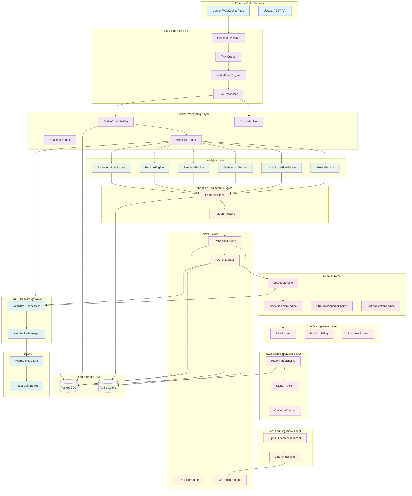
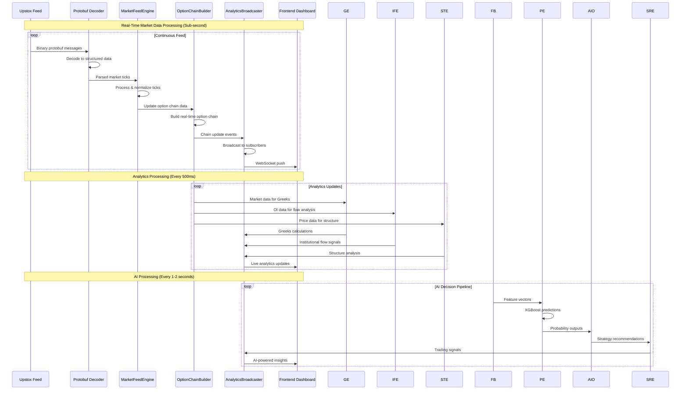
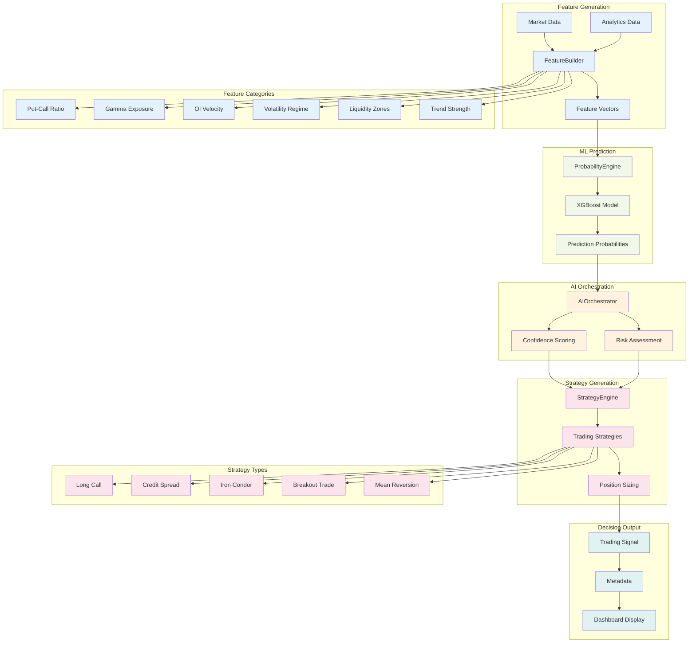
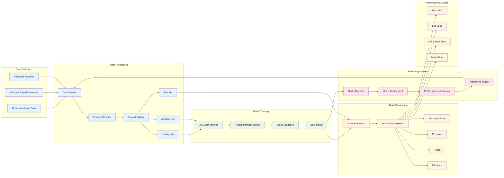
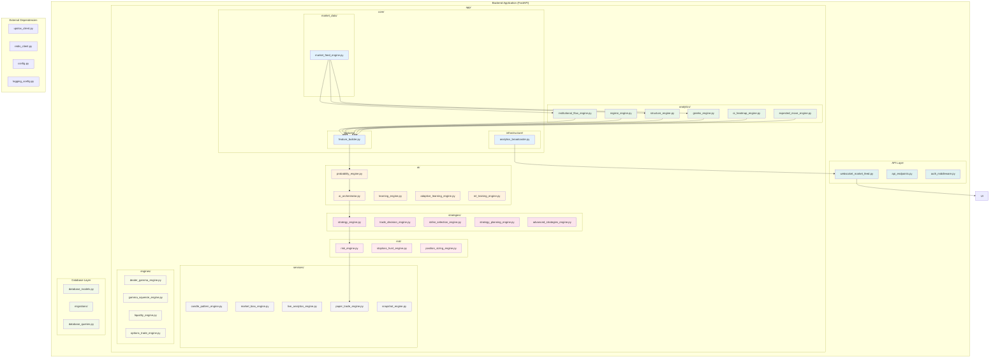

# StrikeIQ System Architecture Diagrams

**Real-Time Options Analytics & AI-Driven Trading Intelligence Platform**

---

## 1️⃣ High-Level System Architecture

### Explanation
This high-level architecture shows the complete StrikeIQ system from data ingestion to frontend delivery. The flow moves from left to right through distinct layers, each with specific responsibilities. The color coding helps identify different functional areas: data sources (blue), processing (purple), analytics (green), AI/ML (orange), strategy (pink), risk (red), storage (light green), and delivery (teal).

---

## 2️⃣ Real-Time Data Flow Diagram

### Explanation
This sequence diagram illustrates the real-time data flow through the StrikeIQ system. The process operates at different frequencies: market data updates continuously (sub-second), analytics calculations every 500ms, and AI decisions every 1-2 seconds. The diagram shows how raw market data flows through processing layers, gets enriched with analytics, and finally delivers AI-powered insights to the frontend via WebSocket connections.

---

## 3️⃣ AI Decision Pipeline

### Explanation
The AI Decision Pipeline shows how raw market data transforms into actionable trading signals. The process starts with feature generation, where market and analytics data are converted into ML-ready feature vectors. These features feed into the XGBoost model for probability prediction, which then passes to the AI Orchestrator for confidence scoring and risk assessment. Finally, the Strategy Engine generates specific trading recommendations with appropriate position sizing.

---

## 4️⃣ ML Training Pipeline

### Explanation
The ML Training Pipeline illustrates the complete machine learning lifecycle for StrikeIQ. It starts with data collection from historical market data, signal outcomes, and features. The data undergoes cleaning, feature selection, and splitting into training/validation/test sets. The XGBoost model is trained with hyperparameter tuning and cross-validation. Performance is evaluated using multiple metrics before the best model is deployed to production. Continuous monitoring triggers retraining when performance degrades.

---

## 5️⃣ Backend Module Structure

### Explanation
This diagram shows the detailed backend module structure after the architecture cleanup. The modules are organized into logical layers with clear responsibilities. The color coding helps identify different functional areas: analytics (green), AI/ML (orange), strategies (pink), risk (red), core infrastructure (blue), services (gray), specialized engines (light green), API (teal), and database (light green). The arrows indicate key dependencies between modules.

---

## Architecture Summary

The StrikeIQ system architecture represents a production-grade, real-time options analytics platform with the following key characteristics:

### 🚀 **Performance Optimized**
- Sub-second market data processing
- Efficient WebSocket communication
- Redis caching for hot data
- AsyncIO for concurrent operations

### 🧠 **AI-Driven Intelligence**
- XGBoost-based probability predictions
- Real-time feature engineering
- Continuous learning and adaptation
- Multi-strategy decision orchestration

### 🛡️ **Risk-Aware Design**
- Comprehensive risk management
- Position sizing and stop-loss
- Paper trading simulation
- Outcome tracking and feedback

### 📊 **Real-Time Analytics**
- Live market structure analysis
- Institutional flow detection
- Options Greeks calculations
- Volatility regime identification

### 🔧 **Scalable Architecture**
- Modular component design
- Clear separation of concerns
- Easy to extend and maintain
- Production-ready deployment patterns

This architecture supports high-frequency market data processing while maintaining low latency for real-time trading insights, making it suitable for professional options trading applications.
